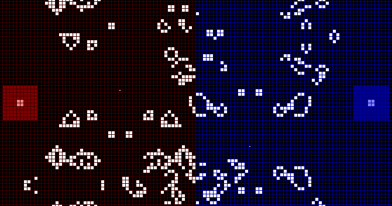
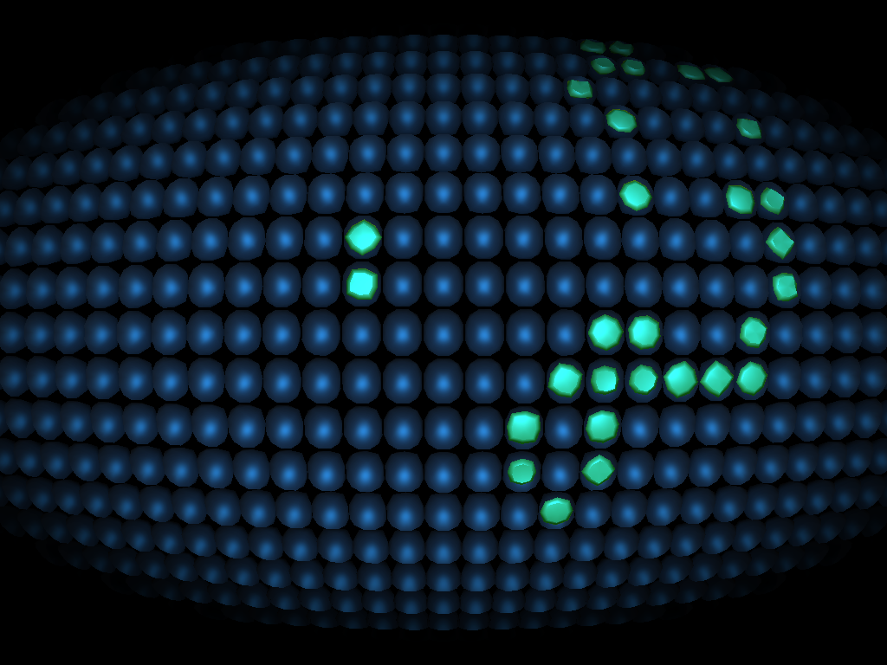
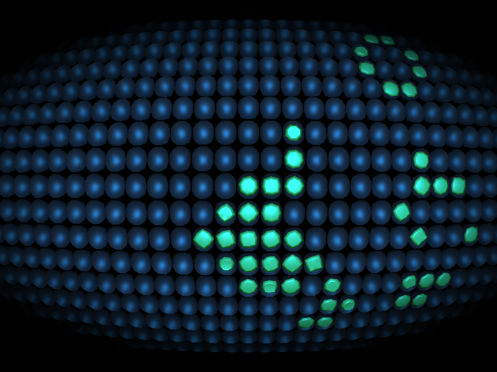
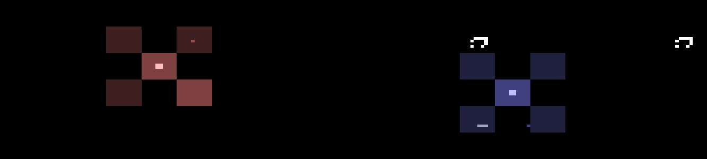

#:four_leaf_clover: Game Of Life Fighter

Game Of Life Fighter is an action game based on Conway's Game Of Life, programmed in C++ using the Qt and Urho3D libraries.

Goal is to destroy the other player his/her base its heart. 

To to so, you can build patterns in your own part of the screen. Pressing `Activate` sets them loose!

There are multiple version, differing in the choice of graphics library used:

 * A 2D version using Qt
 * A 2D version using SFML
 * A 3D version using Urho3D

## Nostalic screenshots

The classic version, with four little hangars per player.

## Controls

Player 1:

 * `Q`: Build
 * `W`: Move up
 * `E`: Activate
 * `A`: Move left
 * `S`: Move down
 * `D`: Move right
 * `Z`: Pre-fab pattern 1
 * `X`: Pre-fab pattern 2
 * `C`: Pre-fab pattern 3

Player 2:

 * `U`: Build
 * `I`: Move up
 * `O`: Activate
 * `J`: Move left
 * `K`: Move down
 * `L`: Move right
 * `M`: Pre-fab pattern 1
 * `,` (comma): Pre-fab pattern 2
 * `.` (period, dot): Pre-fab pattern 3
