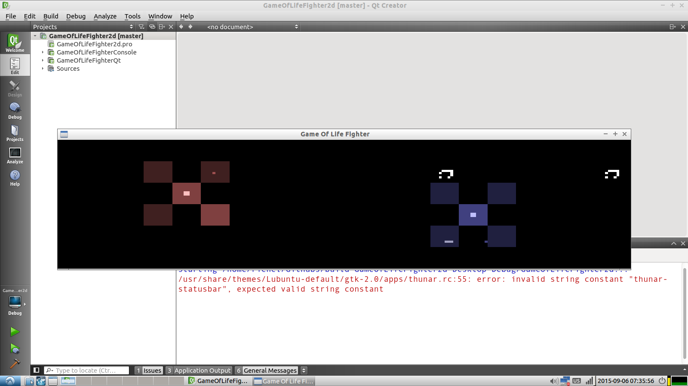

#:four_leaf_clover: Game Of Life Fighter

Game Of Life Fighter is an action game based on Conway's Game Of Life, programmed in C++ using the Qt and Urho3D libraries.

Goal is to destroy the other player his/her base its heart. 

To to so, you can build patterns in the four hangars around your own heart. 
Don't forget to close the hangar before building.
After building, you can set your creations loose by opening up the hangar again.

There are two versions:
 * A 2D version
 * A 3D version

## Controls

Player 1:

 * `1`: Pre-fab pattern 1
 * `2`: Pre-fab pattern 2
 * `3`: Pre-fab pattern 3
 * `Q`: Close hangar
 * `W`: Move up
 * `E`: Build
 * `A`: Move left
 * `S`: Move down
 * `D`: Move right
 * `Z`: Open hangar
 * `X`: [has no function]
 * `C`: Remove (the opposite of build)

Player 2:

 * `7`: Pre-fab pattern 1
 * `8`: Pre-fab pattern 2
 * `9`: Pre-fab pattern 3
 * `U`: Close hangar
 * `I`: Move up
 * `O`: Build
 * `J`: Move left
 * `K`: Move down
 * `L`: Move right
 * `M`: Open hangar
 * `,` (comma): [has no function]
 * `.` (period, dot): Remove (the opposite of build)
